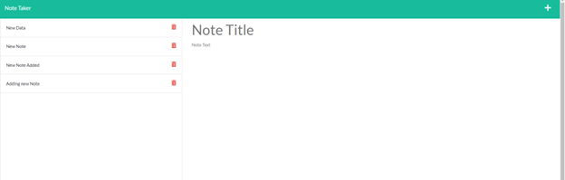

# Note Taker 

## User Story 
AS A small business owner
I WANT to be able to write and save notes
SO THAT I can organize my thoughts and keep track of tasks I need to complete

## Description
  An application that utilizes API routes and HTML routes to get,post, and delete information for a Note Take Application. The Note Taker app allows the user to add, save, delete notes to and from the database. The Front-end was provided, and the back-end had to be connected. Used PORTs and environment variable to display application in the web browser and Heroku. Testing was done through Insomnia, web browser, intergrated-terminal using console logs, and Heroku.

## Table of Contents 
  * [Installation](#installation)
  * [Usage](#usage)
  * [Important-Links](#Important-Links)
  * [Questions](#questions)

  ## Installation
  * Ensure you are in your root folder,then open terminal and clone code from github. Then run these in the command terminal:

  * Next, run "npm init -y" to install packages 
  * Express Sever Setup - "npm i express" > 
  * Create Heroku Account > in Terminal "heroku create" > git add, git commit, git push heroku 'branch name':main
  * Don't forget to add express, require statements and const router = require('express').Router(); since "app" was primarily used in server.js

   ## Usage 
  Used to a note taker for the end-user. 
  * Firstly, open the terminal 
  * To acitvate the application start your sever with "npm start"
  * Then to run the application in web Browser use: http://localhost:3001/
  * IF you want to start it in Heroku, start the server then navigate to https://note-taker-pro-max.herokuapp.com/
  * If you want to test api routes or application in Insomnia, start Insomnia and use proper url and route.
  * User can insert Note Title then Note Text and Save directly. The note will be stored for future use. 
  * Notes can be created and deleted. 

   

   
 
   
 
   

 ## Important Links 
* GitHub Link: https://github.com/MichaelZimm20/note-taker

* Heroku Link: https://note-taker-pro-max.herokuapp.com/

## Questions 
  If you have any questions or concerns, contact:
  * GitHub: [MichaelZimm20](https://github.com/MichaelZimm20)
